# Mokosh 🌊

Mokosh is a lightweight, AST-powered dependency graph generator for modern web and script projects. It extracts import maps from JavaScript, TypeScript, Python, CSS, SCSS, Less, Stylus, CoffeeScript, LiveScript, Lua, and Gherkin files to help AI models and developers understand code relationships efficiently.

Designed for performance and RAG (Retrieval-Augmented Generation) workflows, Mokosh enables you to visualize your project structure, traverse dependencies, and even propose test tags based on code changes.

## Features

- **Multi-Language Support**: Robust extraction from:
    - **JavaScript/TypeScript**: static `import`, dynamic `import()`, `require()`, and re-exports.
    - **CSS/SCSS/Less/Stylus**: tracks `@import` relationships.
    - **CoffeeScript/LiveScript/Lua/Gherkin**: AST-based parsing for dependencies and tags.
- **Graph Traversal**: Programmatically explore dependencies from any entry point with depth control.
- **Visual Diagrams**: Export your dependency graph to Mermaid.js format.
- **Lock File Integration**: Automatically extract dependency versions and tags from `package-lock.json`, `yarn.lock`, and `pnpm-lock.yaml`.
- **Unused File Detection**: Identify files in your project that are not imported by any entry point.
- **Caching**: Serialize and deserialize the graph to save computation time.
- **Filtering & Token Saving**: Use `--query` to filter nodes and dependencies, significantly reducing the size of the output for AI models.
- **Test Tag Proposal**: Automatically identify affected Playwright/Cucumber test tags based on `git diff`.
- **Feature Hub Detection**: Identify architectural hub files (files that import many internal modules — orchestrators/aggregators) and surface them as `feature:<name>` tags. Prevents tag explosion when a widely-used utility changes.

## Token Saving with Queries

When working with large codebases, providing the entire dependency graph to an AI model can exceed context limits or waste tokens. Use the `--query` flag to filter the output to only what's relevant:

- **Filter by language**: `--query "type:python"`
- **Filter by category**: `--query "category:ui"`
- **Filter by tag**: `--query "tag:core"`
- **Combine filters**: `--query "category:logic,tag:api"`

Example of a focused query:
```bash
npx mokosh --query "type:typescript,category:logic" src/index.ts
```

## Supported Languages & Tags

Mokosh automatically detects file types and uses the appropriate parser. You can also group files using `@tag <name>` in comments:

| Language | Extension | Tag Example |
| --- | --- | --- |
| JavaScript | `.js`, `.jsx` | `// @tag core` |
| TypeScript | `.ts`, `.tsx` | `// @tag models` |
| CSS/SCSS/Less | `.css`, `.scss`, `.less` | N/A |
| Stylus | `.styl` | N/A |
| CoffeeScript | `.coffee` | `# @tag script` |
| LiveScript | `.ls` | `# @tag app` |
| Lua | `.lua` | `-- @tag config` |
| Gherkin | `.feature` | `@smoke` |

## Installation

```bash
npm install mokosh
```

## Quick Start

### CLI Usage

Generate a dependency graph as JSON:
```bash
npx mokosh src/index.ts
```

Generate a Mermaid diagram:
```bash
npx mokosh --mermaid src/index.ts > graph.mmd
```

Propose test tags for changed files:
```bash
npx mokosh --propose-tags src/index.ts
```

Detect feature hub files (high in-degree):
```bash
npx mokosh --detect-features src/index.ts
```

Find unused files:
```bash
npx mokosh --find-unused src/index.ts
```

Use caching to speed up subsequent runs:
```bash
npx mokosh --cache mokosh-cache/graph.json src/index.ts
```

> **Note:** Add `mokosh-cache/` to your `.gitignore` to avoid committing the cache directory.

Filter graph by category and tag:
```bash
npx mokosh --query "category:logic,tag:auth" src/index.ts
```

### Options

- `--cache [file]`: Path to cache file. If no file is provided, it defaults to `mokosh-cache/graph.json` in the project root.
- `--root <dir>`: Set the project root directory (default: current directory).
- `--mermaid`: Output a Mermaid chart (`graph TD`) instead of JSON.
- `--propose-tags`: Use `git diff` to identify changed files and propose relevant test tags by traversing the dependency graph.
- `--affected-tests`: Like `--propose-tags` but outputs test file paths instead of tags — pipe directly into a test runner: `vitest $(mokosh --affected-tests)`.
- `--detect-features`: Output files with high in-degree (feature hubs), sorted by number of importers descending.
- `--feature-threshold <N>`: Minimum importers for a file to be a feature hub (default: `5`). Applies to `--detect-features`, `--propose-tags`, and `--affected-tests`.
- `--find-unused`: Scan the project for files that are not reachable from the specified entry points.
- `--query <query>`: Filter the output graph using a query string (e.g., `category:logic,tag:auth,path:src/api`).
- `--help`: Show usage information.

### Programmatic API

```typescript
import { createImportMap } from 'mokosh';

const rootDir = process.cwd();
const entryPoints = ['src/main.ts'];

const graph = createImportMap(rootDir, entryPoints);

// Traverse the graph
graph.traverse('src/main.ts', (node, depth) => {
  console.log(`${'  '.repeat(depth)} ${node.path}`);
});

// Export to Mermaid
console.log(graph.toMermaid());
```

## Documentation

For detailed information on each process, check the following guides:

- [Architecture Overview](./docs/architecture.md)
- [Product Requirements Document (PRD)](./docs/prd.md)
- [Usage Guide](./docs/usage.md)
- [Query Language Guide](./docs/query.md)
- [Graph Traversal](./docs/traversal.md)
- [Test Tag Proposal](./docs/test-tags.md)
- [Lock File Analysis](./docs/lock-files.md)

## License

ISC


### MERMAID 

```mermaid
graph TD
src/config.ts --> node:fs
src/config.ts --> node:path
src/config.ts --> src/parser/classify.ts
src/git.ts --> node:child_process
src/parser/lockfile.ts --> node:fs
src/parser/lockfile.ts --> node:path
src/parser/lockfile.ts --> js-yaml
src/parser/file-type.ts --> node:path
src/parser/file-type.ts --> src/types.ts
src/parser/types.ts --> src/types.ts
src/parser/tagging/index.ts --> typescript
src/parser/tagging/index.ts --> src/parser/types.ts
src/parser/code.ts --> node:path
src/parser/code.ts --> typescript
src/parser/code.ts --> src/types.ts
src/parser/code.ts --> src/parser/classify.ts
src/parser/code.ts --> src/parser/file-type.ts
src/parser/code.ts --> src/parser/tagging/index.ts
src/parser/code.ts --> src/parser/types.ts
src/parser/coffee.ts --> coffeescript
src/parser/coffee.ts --> src/types.ts
src/parser/coffee.ts --> src/parser/file-type.ts
src/parser/coffee.ts --> src/parser/types.ts
src/parser/registry.ts --> src/types.ts
src/parser/registry.ts --> src/parser/types.ts
src/parser/gherkin.ts --> cucumber/gherkin
src/parser/gherkin.ts --> cucumber/messages
src/parser/gherkin.ts --> src/parser/registry.ts
src/parser/gherkin.ts --> src/parser/types.ts
src/parser/ls.ts --> livescript
src/parser/ls.ts --> src/types.ts
src/parser/ls.ts --> src/parser/file-type.ts
src/parser/ls.ts --> src/parser/types.ts
src/parser/lua.ts --> luaparse
src/parser/lua.ts --> src/types.ts
src/parser/lua.ts --> src/parser/file-type.ts
src/parser/lua.ts --> src/parser/types.ts
src/parser/python.ts --> node:crypto
src/parser/python.ts --> node:fs
src/parser/python.ts --> node:https
src/parser/python.ts --> node:os
src/parser/python.ts --> node:path
src/parser/python.ts --> web-tree-sitter
src/parser/python.ts --> src/types.ts
src/parser/python.ts --> src/parser/file-type.ts
src/parser/python.ts --> src/parser/types.ts
src/parser/style.ts --> src/types.ts
src/parser/style.ts --> src/parser/file-type.ts
src/parser/style.ts --> src/parser/types.ts
src/parser.ts --> src/parser/code.ts
src/parser.ts --> src/parser/coffee.ts
src/parser.ts --> src/parser/file-type.ts
src/parser.ts --> src/parser/gherkin.ts
src/parser.ts --> src/parser/ls.ts
src/parser.ts --> src/parser/lua.ts
src/parser.ts --> src/parser/python.ts
src/parser.ts --> src/parser/registry.ts
src/parser.ts --> src/parser/style.ts
src/parser.ts --> src/parser/types.ts
src/parser.ts --> src/types.ts
src/parser.ts --> src/parser/classify.ts
src/graph/analyzer.ts --> src/types.ts
src/graph/model.ts --> src/types.ts
src/graph/model.ts --> src/graph/analyzer.ts
src/graph/resolver.ts --> node:fs
src/graph/resolver.ts --> node:path
src/graph/builder.ts --> node:fs
src/graph/builder.ts --> node:path
src/graph/builder.ts --> src/parser/lockfile.ts
src/graph/builder.ts --> src/parser.ts
src/graph/builder.ts --> src/types.ts
src/graph/builder.ts --> src/graph/model.ts
src/graph/builder.ts --> src/graph/resolver.ts
src/graph/exporter.ts --> src/graph/model.ts
src/graph/features/index.ts --> node:path
```

